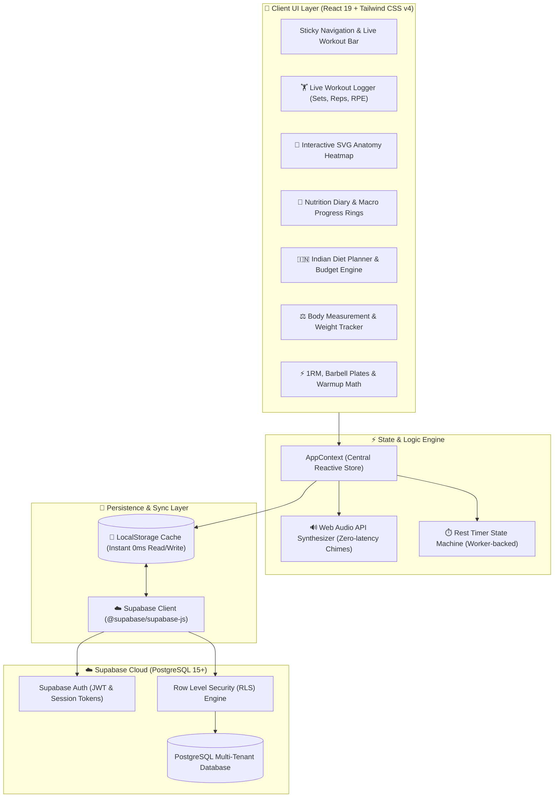
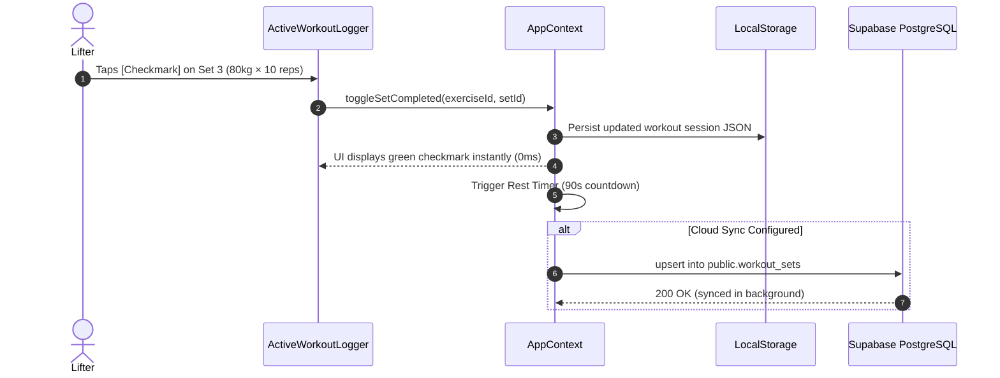

# 🏛️ FITRACK: System Architecture & Technical Specifications

> **High-Performance, Offline-First Gym & Indian Nutrition PWA**  
> *Combining Wger's comprehensive tracking, Hevy's in-gym UX, Workout.Cool's anatomical mapping, and an Indian Mandi-priced Nutrition Engine.*

---

## 1. High-Level System Architecture

FITRACK is engineered as a zero-latency, mobile-first Progressive Web Application (PWA). It follows a **Local-First, Cloud-Synced** architectural model to guarantee 100% responsiveness in underground gyms or poor cellular connectivity zones.



---

## 2. Frontend Tech Stack & Decisions

| Technology | Role | Justification |
| :--- | :--- | :--- |
| **React 19** | Component Framework | Modern concurrent rendering, instant updates during live set logging. |
| **Vite 8** | Build System & Dev Server | Sub-second Hot Module Replacement (HMR) and optimized minified ES module chunking. |
| **TypeScript 6** | Type Safety | Enforces strict schemas across workout sets, nutrition logs, and Supabase RPC models. |
| **Tailwind CSS v4** | UI & Styling Engine | Lightning-fast CSS compilation, native CSS variables, ultra-dark athletic obsidian theme (`#0b0d13`). |
| **Lucide React** | Icons | Crisp, accessible SVG icons for gym exercises and Indian dietary categories. |
| **Web Audio API** | Audio Rest Timer | Generates synthetic frequencies directly via hardware audio cards; zero network audio asset lag. |
| **Canvas Confetti** | Visual Celebration | Triggers celebratory particle animations upon workout completion. |

---

## 3. State Management & Offline-First Strategy

### 3.1 Local-First Paradigm
Gyms are notoriously infamous for poor cellular signal (often situated in basements or commercial steel-framed buildings). 
1. **Immediate Local Mutation:** Every set logged, water glass tracked, or weight entry recorded updates `AppContext` state and writes immediately to `localStorage`.
2. **Optimistic Updates:** The UI never displays loading spinners for routine updates or set checkmarks.
3. **Cloud Synchronization:** When an active connection and valid Supabase credentials (`VITE_SUPABASE_URL` and `VITE_SUPABASE_ANON_KEY`) are present, the sync manager triggers batched upserts to Supabase PostgreSQL with user ID isolation.



---

## 4. Web Audio API Synthesizer Architecture

Rather than loading bulky `.mp3` or `.wav` sound files over network requests that could fail or lag in the gym, FITRACK implements a zero-dependency **Web Audio Synthesizer**:

```typescript
// Custom Audio Synthesizer snippet from src/services/audioService.ts
class WebAudioSynthesizer {
  private ctx: AudioContext | null = null;

  playCountdownBeep() {
    // 880Hz short sine wave pulse for 3-2-1 rest timer warning
    this.playTone(880, 0.08, 'sine', 0.2);
  }

  playBuzzer() {
    // 440Hz dual pulse signifying rest period expired
    this.playTone(440, 0.4, 'triangle', 0.3);
  }

  playSuccessFanfare() {
    // Multi-chord major arpeggio celebrating workout completion
    [523.25, 659.25, 783.99, 1046.50].forEach((freq, i) => {
      setTimeout(() => this.playTone(freq, 0.2, 'triangle', 0.25), i * 120);
    });
  }
}
```

---

## 5. Security & Multi-Tenancy Architecture

All Supabase PostgreSQL tables are locked with **Row Level Security (RLS)**:
- **Global Catalogs (Public Read):** Exercises and verified Indian food items have `user_id IS NULL`, allowing any user to read them publicly without permissions.
- **Private User Records (Private Read/Write):** Profile data, custom exercises, routines, workout sessions, meal logs, and body measurements are restricted with `auth.uid() = user_id`.
- **Database Triggers:** When a user registers via Supabase Auth, `public.handle_new_user()` automatically initializes a blank profile with default Indian dietary targets.

---

## 6. Progressive Web App (PWA) Specifications

- **Manifest:** Standalone display mode with dark system chrome theme `#0b0d13`.
- **Haptic Feedback:** Integrates `navigator.vibrate([100, 50, 100])` for vibrating pocket notifications when the rest timer reaches 0 seconds.
- **Responsive Viewport:** Mobile viewport configured with `viewport-fit=cover` and `user-scalable=no` for native-like touch targets.
