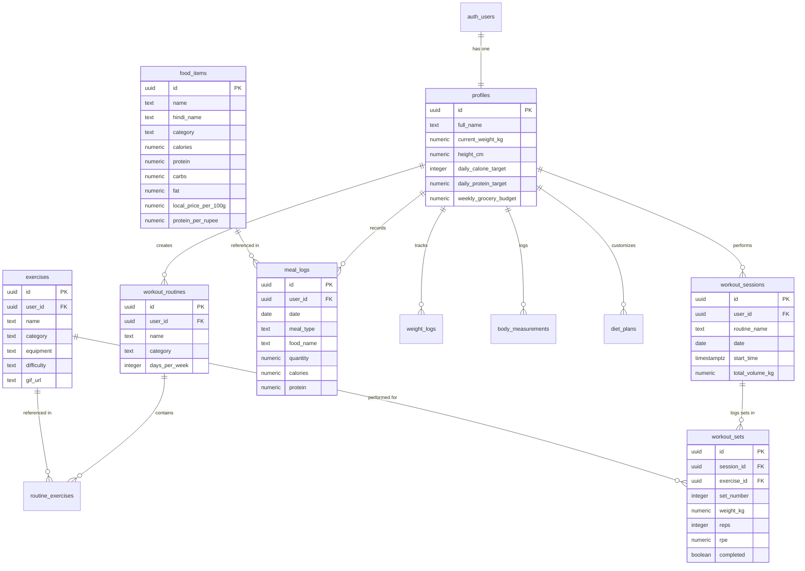

# 🗄️ FITRACK: Supabase PostgreSQL Database Schema & RLS

> **Complete Database Specifications, Entity Relationships, and Multi-Tenant Security**

---

## 1. Entity-Relationship Diagram (ERD)



---

## 2. Table Data Dictionary

### 2.1 `profiles`
Stores user anthropometric details, fitness goals, and target nutritional values.

| Column | Type | Constraints | Description |
| :--- | :--- | :--- | :--- |
| `id` | `UUID` | `PK, REFERENCES auth.users(id)` | Maps 1:1 with Supabase Auth |
| `full_name` | `TEXT` | `NOT NULL` | Display name of the lifter |
| `gender` | `TEXT` | `'male' \| 'female' \| 'other'` | Biological sex for BMR formulas |
| `height_cm` | `NUMERIC(5,2)` | | Height in centimeters |
| `current_weight_kg` | `NUMERIC(5,2)` | | Current body weight |
| `target_weight_kg` | `NUMERIC(5,2)` | | Target goal weight |
| `activity_level` | `TEXT` | `DEFAULT 'moderately_active'` | Sedentary to Extremely Active |
| `daily_calorie_target` | `INTEGER` | `DEFAULT 2200` | Maintenance/cutting/bulking kcal |
| `daily_protein_target` | `NUMERIC(5,1)`| `DEFAULT 140.0` | Target protein in grams |
| `daily_carb_target` | `NUMERIC(5,1)`| `DEFAULT 240.0` | Target carbohydrates in grams |
| `daily_fat_target` | `NUMERIC(5,1)`| `DEFAULT 60.0` | Target dietary fats in grams |
| `weekly_grocery_budget`| `NUMERIC(7,2)`| `DEFAULT 1200.0` | Weekly Indian grocery limit (₹) |
| `water_goal_ml` | `INTEGER` | `DEFAULT 3500` | Daily hydration goal in ml |

---

### 2.2 `exercises`
Master catalog of strength training exercises with animated form previews.

| Column | Type | Constraints | Description |
| :--- | :--- | :--- | :--- |
| `id` | `UUID` | `PK, DEFAULT gen_random_uuid()` | Unique exercise ID |
| `user_id` | `UUID` | `REFERENCES auth.users(id)` | `NULL` = global catalog, UUID = user custom |
| `name` | `TEXT` | `NOT NULL` | Exercise title (e.g. Incline DB Press) |
| `category` | `TEXT` | `NOT NULL` | Primary muscle group (e.g. 'chest', 'back') |
| `secondary_muscles` | `TEXT[]` | | Supporting muscle groups |
| `equipment` | `TEXT` | `NOT NULL` | 'barbell', 'dumbbell', 'cable', etc. |
| `difficulty` | `TEXT` | `DEFAULT 'intermediate'` | Skill level |
| `instructions` | `TEXT[]` | `NOT NULL` | Step-by-step cue array |
| `gif_url` | `TEXT` | | Animated form preview GIF |
| `is_custom` | `BOOLEAN` | `DEFAULT FALSE` | True if created by user |

---

### 2.3 `food_items`
Indian staples and bodybuilding nutrition database with Mandi prices.

| Column | Type | Constraints | Description |
| :--- | :--- | :--- | :--- |
| `id` | `UUID` | `PK, DEFAULT gen_random_uuid()` | Unique food ID |
| `name` | `TEXT` | `NOT NULL` | English name (e.g. Soya Chunks) |
| `hindi_name` | `TEXT` | | Culturally authentic Hindi name |
| `category` | `TEXT` | `NOT NULL` | 'dal_legume', 'dairy', 'egg', 'meat', etc. |
| `diet_type` | `TEXT` | `NOT NULL` | 'veg', 'non_veg', 'egg', 'vegan' |
| `serving_unit` | `TEXT` | `NOT NULL` | '100g', '1 roti (40g)', '1 katori' |
| `calories` | `NUMERIC(6,1)` | `NOT NULL` | Energy per serving unit |
| `protein` | `NUMERIC(5,1)` | `NOT NULL` | Protein in grams |
| `carbs` | `NUMERIC(5,1)` | `NOT NULL` | Carbs in grams |
| `fat` | `NUMERIC(5,1)` | `NOT NULL` | Fats in grams |
| `local_price_per_100g`| `NUMERIC(6,2)`| `DEFAULT 20.0` | Mandi market price in ₹ |
| `protein_per_rupee` | `NUMERIC(5,2)` | `GENERATED STORED` | **Protein Efficiency Formula**: $\frac{\text{Protein (g)}}{\text{Price (₹)}}$ |

---

## 3. Row-Level Security (RLS) Policies

All tables enforce multi-tenant isolation through Postgres RLS:

```sql
-- Public Read for global exercises, private write for user customs
CREATE POLICY "Public read exercises" ON public.exercises
  FOR SELECT USING (user_id IS NULL OR auth.uid() = user_id);

CREATE POLICY "Users can insert custom exercises" ON public.exercises
  FOR INSERT WITH CHECK (auth.uid() = user_id);

-- User Isolation for Workout Sessions
CREATE POLICY "Users can manage workout sessions" ON public.workout_sessions
  FOR ALL USING (auth.uid() = user_id);

-- User Isolation for Workout Sets
CREATE POLICY "Users can manage workout sets" ON public.workout_sets
  FOR ALL USING (
    EXISTS (
      SELECT 1 FROM public.workout_sessions 
      WHERE id = workout_sets.session_id AND user_id = auth.uid()
    )
  );
```

---

## 4. Automatic User Profile Trigger

Upon successful user authentication, Supabase Auth emits an `AFTER INSERT` trigger into `auth.users`, which provisions their initial profile row automatically:

```sql
CREATE OR REPLACE FUNCTION public.handle_new_user()
RETURNS trigger AS $$
BEGIN
  INSERT INTO public.profiles (
    id,
    full_name,
    daily_calorie_target,
    daily_protein_target,
    water_goal_ml
  )
  VALUES (
    NEW.id,
    COALESCE(NEW.raw_user_meta_data->>'full_name', 'Desi Lifter'),
    2200,
    140.0,
    3500
  )
  ON CONFLICT (id) DO NOTHING;
  RETURN NEW;
END;
$$ LANGUAGE plpgsql SECURITY DEFINER;

CREATE TRIGGER on_auth_user_created
  AFTER INSERT ON auth.users
  FOR EACH ROW EXECUTE FUNCTION public.handle_new_user();
```

---

## 5. How to Apply Schema to Your Supabase Project

1. Log in to [Supabase Console](https://supabase.com).
2. Create or open your project.
3. Open the **SQL Editor** from the left-hand navigation.
4. Copy the entire contents of [`supabase/schema.sql`](file:///c:/Users/adity/Downloads/FITRACK/supabase/schema.sql) and paste into the editor.
5. Click **Run**.
6. (Optional) Run [`supabase/seed.sql`](file:///c:/Users/adity/Downloads/FITRACK/supabase/seed.sql) to populate 60+ exercises and Indian foods.
