# 🏋️ FITRACK: 850+ Exercises Dataset & Anatomical Heatmap Engine

> **Taxonomy, Muscle Group Architecture, Media CDN Strategy, and Workout.Cool SVG Mapping**

---

## 1. Exercise Taxonomy & Muscle Group Architecture

FITRACK structures exercises according to functional biomechanics, isolating primary mover muscles and secondary synergistic stabilisers:

```mermaid
graph TD
    Body["🏋️ Human Anatomical Model"]
    
    Upper["Upper Body"]
    Lower["Lower Body"]
    Core["Core & Posterior Chain"]

    Upper --> Chest["Chest (Pectoralis Major / Minor)"]
    Upper --> Back["Back (Lats, Traps, Rhomboids)"]
    Upper --> Shoulders["Shoulders (Anterior, Lateral, Posterior Delts)"]
    Upper --> Arms["Arms (Biceps Brachii, Triceps, Forearms)"]

    Lower --> Quads["Quads (Rectus Femoris, Vastus Lateralis/Medialis)"]
    Lower --> Hamstrings["Hamstrings (Biceps Femoris)"]
    Lower --> Glutes["Glutes (Maximus & Medius)"]
    Lower --> Calves["Calves (Gastrocnemius, Soleus)"]

    Core --> Abs["Abs (Rectus Abdominis, Obliques)"]
    Core --> LowerBack["Lower Back (Erector Spinae)"]
```



---

## 2. Equipment Classification

Every exercise belongs to one of seven primary gym equipment categories to allow rapid filtering in any training environment:

| Equipment Tag | Ideal Training Environment | Key Exercise Examples |
| :--- | :--- | :--- |
| **`barbell`** | Powerlifting, Commercial Gyms | Barbell Bench Press, Back Squat, Conventional Deadlift, Overhead Press |
| **`dumbbell`** | Home Gym, Hotel, Commercial Gym | Incline DB Press, Lateral Raises, Romanian Deadlifts, Hammer Curls |
| **`cable`** | Commercial Gyms | Cable Tricep Pushdown, Face Pulls, Low-to-High Cable Flyes, Lat Pulldowns |
| **`machine`** | Commercial Gyms | Leg Press, Hack Squat, Pec Deck Fly, Seated Hamstring Curl |
| **`bodyweight`**| Calisthenics, Home, Park | Pull-Ups, Dips, Push-Ups, Bulgarian Split Squats, Pistol Squats |
| **`kettlebell`** | Functional Cross-training | Kettlebell Swings, Turkish Get-Ups, Goblet Squats |
| **`smith_machine`**| Hypertrophy & Joint-Friendly Training| Smith Machine Incline Press, Smith Squats, Smith Shrugs |

---

## 3. Animated GIF Media Streaming Strategy

FITRACK utilizes high-definition, smooth looping form GIFs extracted from open-source gym repositories (`free-exercise-db` & `wger`).

### 3.1 CDN & Delivery Pipeline
- **Primary Delivery:** Fast GitHub Raw / jsDelivr CDN streaming for 0-latency caching.
- **Resolution & Size Optimization:** GIFs are optimized to 300x300 or 400x400 loop sequences, averaging $<1.2\text{ MB}$ per exercise.
- **Progressive Fallback:** If offline or if the user is in a low-bandwidth gym mode:
  1. Instant fallback SVG anatomical target glyph is rendered.
  2. Text cues and execution bullet points are immediately available.
  3. GIF lazy-loads only when the exercise card is opened.

---

## 4. Workout.Cool-Style Interactive Anatomical SVG Heatmap

FITRACK incorporates an interactive anatomical SVG body map (inspired by `workout.cool`):

```
       Front View                         Back View
    ┌──────────────┐                   ┌──────────────┐
    │     Head     │                   │     Head     │
    │  [Deltoids]  │                   │   [Traps]    │
    │   [CHEST]    │                   │    [LATS]    │
    │   [Biceps]   │                   │  [Triceps]   │
    │    [ABS]     │                   │ [Lower Back] │
    │   [QUADS]    │                   │   [GLUTES]   │
    │   [Calves]   │                   │ [Hamstrings] │
    │              │                   │   [Calves]   │
    └──────────────┘                   └──────────────┘
```

### 4.1 Integration Mechanics
1. **Interactive SVG Paths:** Each major muscle group (Chest, Lats, Quads, Delts, Hamstrings, Glutes, Abs) is represented by an SVG polygon or `<path>` element with an `id="muscle-slug"`.
2. **Hover & Glow:** Hovering over a muscle region triggers Tailwind's `fill-orange-500/80` with a drop-shadow glow.
3. **One-Tap Filter:** Clicking on a muscle region fires an event:
   ```typescript
   onSelectMuscleGroup('chest');
   // Automatically sets active filter to 'chest' and filters 850+ exercises in 0ms!
   ```
4. **Front / Rear Toggle:** Seamless flip button allows lifters to switch between anterior (front) and posterior (rear) kinetic chain views.
