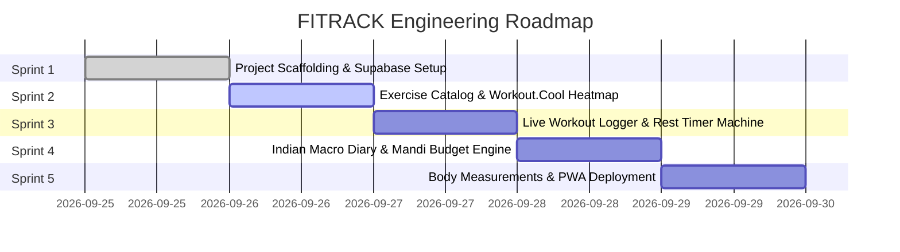

# 🗺️ FITRACK: Implementation Roadmap & Sprint Checklists

> **Phased Engineering Plan, Deliverables, Acceptance Criteria & Definition of Done**

---

## 📅 Sprint Overview Matrix

---

## 🏁 Sprint 1: Project Scaffolding & Supabase Setup (Day 1) — [CURRENT]

### Objectives
Establish modern frontend build system, database schemas, environment variables, responsive mobile layout, and cloud sync architecture.

- [x] **Repository Scaffolding:** Initialize Vite + React 19 + TypeScript + Tailwind CSS v4 in `FITRACK`.
- [x] **Dark Obsidian Design System:** Mobile bottom navigation bar + desktop responsive sidebar (`#0b0d13`).
- [x] **Environment Configuration:**
  - Create `.env.example` with template keys.
  - Create `.env.local` for local credentials.
  - Configure `src/services/supabaseClient.ts` to auto-read `import.meta.env` with `localStorage` fallback.
- [x] **Supabase Database Architecture:**
  - Complete PostgreSQL DDL in `supabase/schema.sql` covering all 10 core tables with Row Level Security (RLS) policies.
  - Automatic user profile trigger (`handle_new_user()`).
  - Starter seed dataset in `supabase/seed.sql` for 1-click cloud database setup.
- [x] **Architecture & Specification Documentation (6 Required Documents):**
  - [x] `PRD.md` (Product Requirements Document)
  - [x] `ARCHITECTURE.md` (System Architecture & State Flow)
  - [x] `DATABASE_SCHEMA.md` (Complete Supabase Schema & RLS)
  - [x] `EXERCISES_DATASET.md` (850+ Exercise Taxonomy & Heatmap)
  - [x] `INDIAN_NUTRITION_INDEX.md` (Mandi Prices & Protein-per-₹)
  - [x] `ROADMAP.md` (Engineering Milestones & Checklists)

---

## 🏋️ Sprint 2: Exercise Library & Workout.Cool Muscle Map (Day 2)

### Objectives
Build out the visual exercise explorer, anatomical SVG body heatmap, and media streaming.

- [ ] **Interactive Anatomical SVG Heatmap:**
  - Front (Anterior) & Back (Posterior) muscle toggles.
  - Hover highlights and click-to-filter for Chest, Lats, Quads, Delts, Hamstrings, Glutes, Abs.
- [ ] **Exercise Search & Equipment Filters:**
  - Real-time instant search bar.
  - Equipment tags (Barbell, Dumbbell, Cable, Machine, Bodyweight).
- [ ] **Animated Form Modal:**
  - Looping exercise GIF guide with muscle targets and execution cues.
  - Pro tips and common mistake warnings.
- [ ] **Custom Exercise Creator:**
  - Ability for lifters to add local gym variations and custom machine setups.

---

## ⏱️ Sprint 3: Hevy-Style Live Gym Workout Logger (Day 3)

### Objectives
Frictionless in-gym workout tracking with previous set memory and audio cues.

- [ ] **Active Gym Session Mode:**
  - Stopwatch timer with live workout banner in navigation.
  - Large numeric keypad friendly inputs for Weight (kg) & Reps.
  - One-tap set completion checkmark with audio click.
  - Previous workout values auto-filled as ghost placeholders.
- [ ] **Sticky Rest Timer Machine:**
  - 30s, 60s, 90s, 120s, 180s presets with +/- 15s quick adjustments.
  - Native Web Audio API 3-2-1 countdown beep and buzzer fanfare.
  - Navigator vibration feedback for phone-in-pocket notifications.
- [ ] **Workout Summary & Confetti:**
  - Total tonnage / volume (kg) calculation.
  - Canvas confetti celebration upon workout completion.
- [ ] **Routine Templates:**
  - PPL (Push / Pull / Legs 6-Day), Upper / Lower, and Desi Pehlwan compound routines.

---

## 🥑 Sprint 4: Full Macro & Indian Budget Diet Diary (Day 4)

### Objectives
Culturally authentic nutrition tracking with Mandi pricing and macro progress rings.

- [ ] **Daily Nutrition Dashboard:**
  - Calorie and macro target rings (Calories, Protein, Carbs, Fats, Fiber).
  - Meal logs: Breakfast, Morning Snack, Lunch, Evening Snack, Dinner, Post-Workout.
  - Water hydration counter (+250ml glass, +500ml bottle).
- [ ] **Desi Food Database with Protein-per-Rupee ($g/₹$):**
  - 40+ authentic staples (Soya chunks, Paneer, Sattu, Besan Chilla, Moong Dal, Chicken).
  - Live sorting by Protein Efficiency ($g/₹$).
- [ ] **Mifflin-St Jeor TDEE & Macro Calculator:**
  - Custom target calculator based on age, gender, height, weight, and activity level.
- [ ] **7-Day Budget Diet Generator:**
  - Generates tailored daily meal schedules adhering to weekly grocery limits (₹120/day to ₹400/day).
- [ ] **Desi Healthy Swaps Engine:**
  - High-protein smart swaps (e.g. Samosa $\rightarrow$ Roasted Chana, Paratha $\rightarrow$ Besan Chilla).

---

## 📏 Sprint 5: Body Measurements & Progress Analytics (Day 5)

### Objectives
Long-term transformation tracking and PWA home screen installation.

- [ ] **Weight Progression Line Charts:**
  - 7-day, 30-day, and all-time weight progression views.
  - Weekly delta calculation (+/- kg per week).
- [ ] **Circumference Tape Tracker:**
  - Chest, shoulders, biceps, waist, hips, thighs, calves, and neck measurements.
- [ ] **US Navy Body Fat % Estimator:**
  - Mathematical calculation using waist, neck, and hip circumferences.
- [ ] **Progress Photos Vault:**
  - Date and weight stamped visual comparison gallery (Front, Side, Back).
- [ ] **PWA Deployment:**
  - Service worker caching for 100% offline functionality.
  - Home screen installation prompt for Android & iOS.

---

## 🎯 Quality Assurance & Definition of Done (DoD)

1. **Zero Runtime Errors:** Clean build (`npm run build`) and zero linter errors (`npm run lint`).
2. **Offline Resilience:** App must operate 100% locally if network drops during a workout.
3. **Audio Performance:** Web Audio API sound triggers with $<5\text{ms}$ latency without external sound downloads.
4. **Mobile Responsive:** All buttons and inputs must have minimum $44\times44\text{px}$ touch targets.
